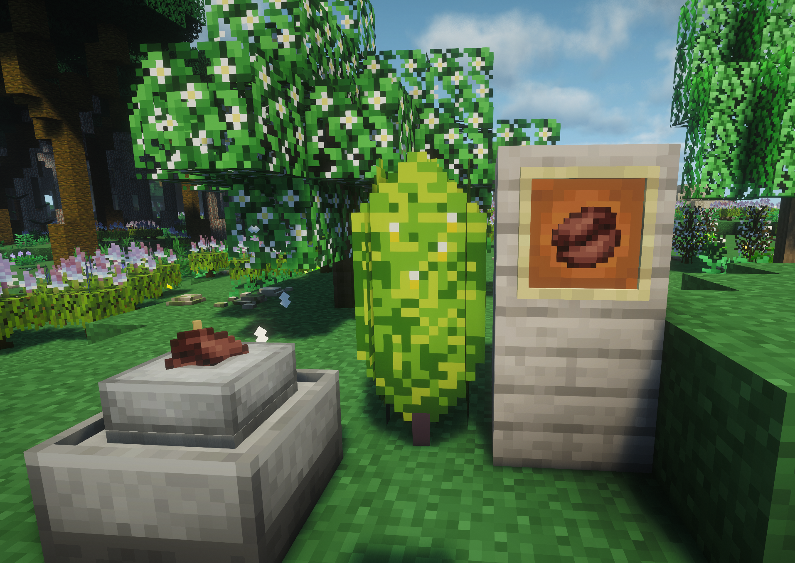

The mod adds tea and coffee trees, as well as a realistic system for producing tea and coffee beverages.

Future versions will add aged alcohol and certain other beverages (because we are completely dissatisfied with the simplicity of the recipes in the existing "TFC Aged Alcohol" addon).

This is not a fork of Caffeinated or TFC Caffeine; the mod is being created from scratch.

The technical name 'jsdrinks' is derived from the project for which the addon was originally created (Journey&Settle).

## Requirements

- Minecraft 1.21.1
- NeoForge 21.1.219 or newer
- TerraFirmaCraft 4.2.11 or newer
- FirmaLife
- Cold Sweat and TFC Cold Sweat (optional, for temperature effects)

## Authors

ganjamonsta - development

Daymix - graphics

413XGreenwich - idea, management
